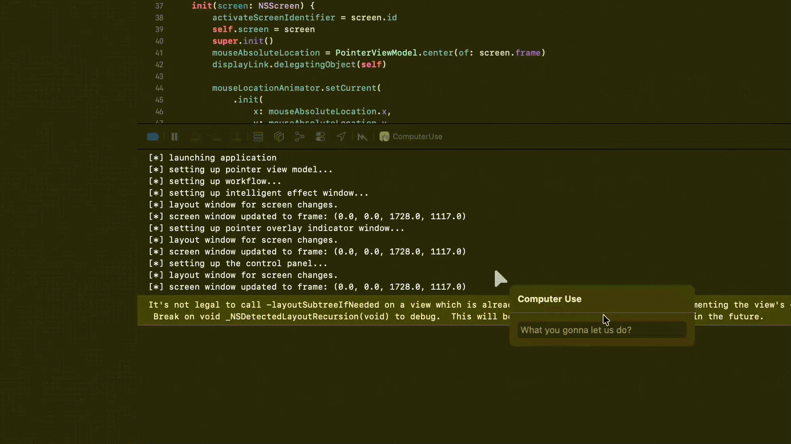

# ComputerUse

ComputerUse is a computer automation tool for macOS, developed in Swift. It allows you to programmatically control keyboard, mouse, screen, and other computer functions.



## Features

- **Keyboard Control**: Simulate key presses, shortcuts, and text input.
- **Pointer Control**: Move mouse, click, drag, and scroll programmatically.
- **Screen Analysis**: Capture screen content and analyze UI elements.
- **Application Management**: Launch, activate, and manage running applications.
- **Workflow Automation**: Define and execute complex automation workflows.

## Installation

### Download Binary

You can download the latest pre-built application directly from the [GitHub Releases](https://github.com/Lakr233/ComputerUse/releases) page. This is the easiest way to get started.

### Build from Source

If you prefer to build from source:

1. Clone the repository:

   ```bash
   git clone https://github.com/Lakr233/ComputerUse.git
   ```

2. Open the Xcode project:

   ```bash
   open ComputerUse.xcodeproj
   ```

3. Build and run the application using Xcode.

## Usage

After launching the app, you can use the provided APIs to perform various computer operations. Refer to the code comments for detailed API documentation.

## License

This project is licensed under the MIT License. See the [LICENSE](LICENSE) file for details.
